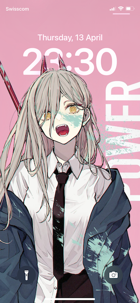

# Chainsaw Man - Power

Steps from [the original image](https://www.pixiv.net/en/artworks/87469406) to [the working version](Power-Lock-Screen.jpg):
* Extract the subject from the original background.
* Use pure pink as the new background.
* Add text on the side. Fine-tune the color.

## NOTICE
The credit of [the original image](https://www.pixiv.net/en/artworks/87469406) goes to [赤倉 on Pixiv](https://www.pixiv.net/en/users/882569). 

The modifications are used for explaining the approach and do not change the copyright of the original work. Follow the copyright instructions of the original author. Personal use only. Cite the original work and the version here properly.
