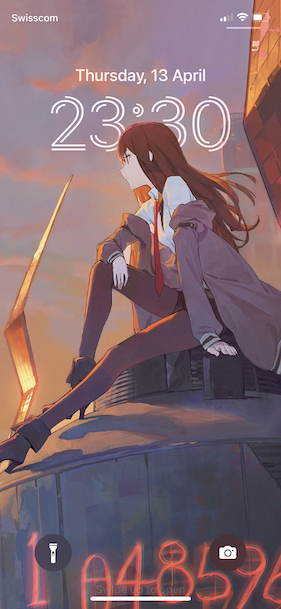

# Steins;Gate - Makise Kurisu

> El Psy Congroo

Steps from [the original image](https://www.pixiv.net/en/artworks/99301428) to [a working version](Kurisu-Lock-Screen.jpg):
* Extend the top margin. In the original image, Kurisu is too close to the top and will overlap too much with the clock. I used the Clone Stamp tool to extend the sky and manually extended the solar board.
* The critical step: denoise the background
  * Select the foreground with Object Selection tool + Direct Selection tool + Magic Wand tool. Select inverse.
  * Denoise with max strength, about 50% color denoise.
  * Gaussian blur.
* Fine-tune the brightness/saturation/contrast of the foreground and the background.

## NOTICE
The credit of [the original image](https://www.pixiv.net/en/artworks/99301428) goes to [モ誰 on Pixiv](https://www.pixiv.net/en/users/1878082).

The modifications are used for explaining the approach and do not change the copyright of the original work. Follow the copyright instructions of the original author. Personal use only. Cite the original work and the version here properly.
